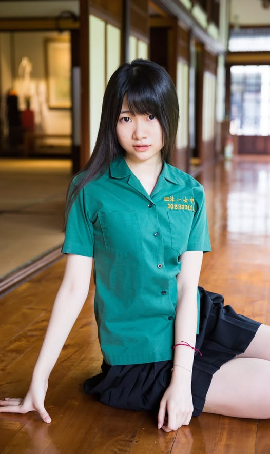

# 2021-06-29 10:30

**日期**: 2021-06-29 10:30
**貼文連結**: https://www.facebook.com/SwankyParty/posts/pfbid0w7EZ9V1MSV5FdVmmKHPhfDPMN9rsXrNtjjbhBmzAjx1mtCkJGQFT1NQ4g8QivAqvl
**互動**: 讚 32 | 留言 0 | 分享 3

---

今天中午12點整開賣李婷婷的最新制服女孩NFT!
https://www.oursong.com/project/pgwqxolr/song-share-card

這次特別包含了一首[飛鳥與蟬]的清唱版本
希望大家會喜歡 :)

=====

<<本次發行包含李婷婷特別清唱[飛鳥與蟬]歌曲>>
<<限量 13 張，建議售價 $12.8 USD>>
<<持有 NFT 將解鎖完整尺寸圖片以及不定期發送更多制服女孩內容>>

可以錯過初戀，但不能錯過制服女孩！

「制服地圖」網站超人氣攝影師史旺基
具特色的臺灣高中制服與可愛的制服女孩
帶給你以「生活感」為主題的青春美好畫面

「青春、制服、汗水的絕對領域，制服控絕對不能錯過的台灣校園聖經！感謝史旺基。」── 波蘿日報 POLONEWS 洨記者

[關於模特兒]
李婷婷，資工少女。北一女畢業後，前往香港科技大學就讀資訊工程，大二開始接觸區塊鏈並在國際論壇及期刊發表論文、拿過最佳論文獎，曾受美國加州大學柏克萊分校區塊鏈研究所邀請，擔任亞洲訪問學者。反送中期間回到台灣，成為台大資工訪問學生。興趣多元，外拍是其中之一，現接案開發多款區塊鏈應用。

FB：https://www.facebook.com/lee.ting.ting.tina
IG：tinaaaaalee

[關於攝影師]
史旺基，本名蕭宇程。《制服．女孩 × 史旺基》系列與《高校制服戀物論》攝影作者、朱學恒「阿宅反抗軍」及「制服地圖」特約攝影師。多次獲法國PX3和美國IPA攝影獎，攝影作品曾登上美國時代雜誌。

「照片上過時代雜誌的攝影師，專拍美少女，工作時的名言是「瀏海順一下」顯見他的龜毛，雖然想拍布料很少的那種，不知為何結果都是清純系。年輕時因為想打電動拒絕了景美熱舞社女孩的邀約，導致連續單身不知多少年，老天有眼，報應不爽。喔對他的正職是工程師，博士學歷的那種。」── 劉揚銘

個人網站：https://swanky.github.io
FB：https://www.facebook.com/SwankyParty
IG：swanbear

[拍賣收益說明]
作品中之模特兒將收到一半分潤
另一半收益將會用於史旺基未來作品拍攝之製作經費
您的贊助是對我們創作之路的極大鼓勵與支持！

追蹤 @swanky 讓你不錯過任何一個發行在OURSONG上的美少女NFT!
https://www.oursong.com/@swanky

## 圖片

