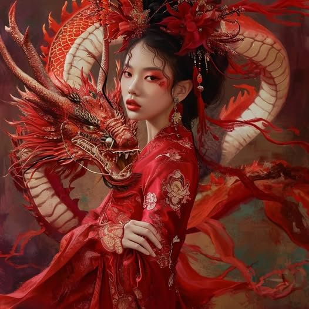

# 2024-01-04 20:56

**日期**: 2024-01-04 20:56
**貼文連結**: https://www.facebook.com/SwankyParty/posts/pfbid02U6HbCPAqmFmzhNsihhhQ29GG9c5UmZxNjYVEQHgsFKmC9WRnvbeifCsEuXqVcZdil
**互動**: 讚 3 | 留言 0 | 分享 0

---

紅衣佳人與龍的傳說相映成趣，每一絲細節都散發著古典東方的魅力。

A lady in red and the legend of the dragon complement each other, with every detail exuding the charm of classical Oriental allure.

赤い衣装の美女と龍の伝説がお互いを引き立て、一つ一つの細部に古典的な東洋の魅力が溢れている。

붉은 옷을 입은 여인과 용의 전설이 서로를 빛내며, 모든 디테일에서 고전적인 동양의 매력이 느껴진다.

#紅衣傳說 #龍之魅力 #古典東方 #攝影藝術 #東方美學 #LadyInRed #DragonLegend #ClassicalOriental #PhotographicArt #EasternAesthetics #赤い衣の美女 #龍の伝説 #東洋の魅力 #写真芸術 #東洋美学 #붉은옷의여인 #용의전설 #고전동양미 #사진예술 #동양의미

## 圖片

